# 🏥 Auditor Médico Digital - Análisis de Facturación Hospitalaria

[](https://python.org)
[](https://jupyter.org)
[](https://scikit-learn.org)
[](https://xgboost.readthedocs.io)

## 📋 Descripción

Sistema inteligente de auditoría médica para la detección automática de **inconsistencias en la facturación hospitalaria**. Utiliza modelos de Machine Learning para identificar fugas de ingresos, códigos CUPS sin soporte clínico, diagnósticos no relacionados y discrepancias en cantidades.

### 🎯 Objetivo

Detectar y priorizar irregularidades en la facturación de servicios de salud mediante análisis predictivo, permitiendo a los auditores enfocar su esfuerzo en los casos de mayor impacto financiero.

---

## 📊 Resultados Clave

| Hallazgo | Valor |
|----------|-------|
| **Procedimientos con fuga (sin facturar)** | 152 |
| **Pérdida estimada** (precio de referencia por CUPS × cantidad realizada) | $78,046,000 COP |
| **Pérdida estimada** (cota conservadora: promedio simple de ítems facturados) | $43,696,371 COP |
| **Valor unitario promedio (ítems facturados)** | $287,476 COP |
| **Registros de HC sin atención asociada** (`ATN-JEF-000001`) | 2 |
| **Mejor modelo (AUC-ROC)** | 0.9185 (Random Forest) |
| **Mejor F1-Score** | 0.7738 (XGBoost) |

> **Nota (revisión 26-jul-2026):** la pérdida se recalculó. La cifra anterior ($41,571,660)
> multiplicaba las fugas por un promedio de `valor_unitario` que incluía los **ceros imputados
> de las propias fugas**; ahora cada fuga se valora con el precio de referencia de su código
> CUPS por la cantidad realizada (detalle por código en el notebook 04).

### 🤖 Rendimiento de Modelos

| Modelo | Escenario | AUC-ROC | F1 | Recall | Precisión |
|--------|-----------|---------|-----|--------|-----------|
| Random Forest | A (Producción) | 0.9185 | 0.7346 | 0.6103 | 0.9225 |
| XGBoost | A (Producción) | 0.9152 | 0.7738 | 0.7282 | 0.8256 |
| Random Forest | B (Features CNN) | 0.8500 | 0.6138 | 0.4564 | 0.9368 |
| XGBoost | B (Features CNN) | 0.8724 | 0.7009 | 0.6308 | 0.7885 |
| CNN (Referencia)* | Transfer Learning | 0.7487 | 0.4710 | 0.3385 | 0.9531 |

> *Corrida original del equipo. La corrida guardada del notebook 08 en este repositorio
> reporta AUC ≈ 0.70 tras fine-tuning — pendiente de re-ejecutar y consolidar una sola cifra.

---

## 📸 Galería de Resultados

### Distribución de Inconsistencias

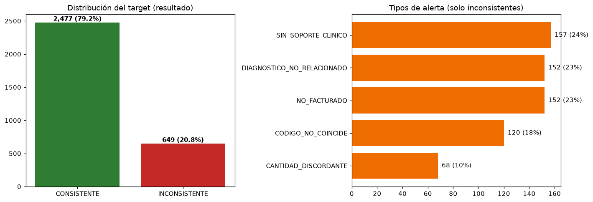

### Análisis por EPS y Sede

| Tasa de Inconsistencia por EPS | Tasa de Inconsistencia por Sede |
|:-----------------------------:|:-------------------------------:|
| 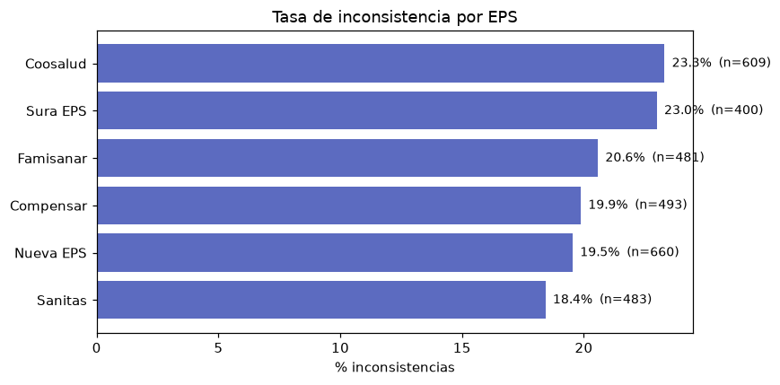 | 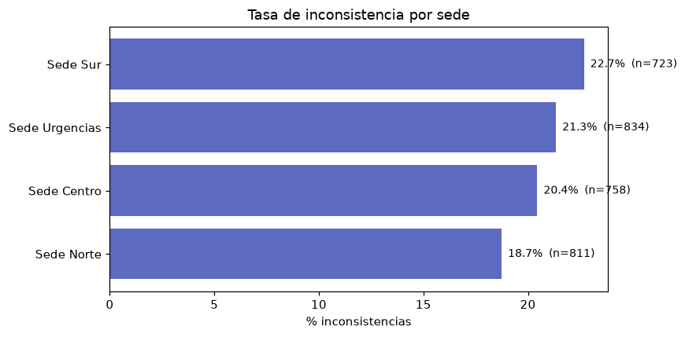 |

### Análisis por Tipo de Atención y Diagnóstico

| Tipo de Atención | Principales Diagnósticos |
|:----------------:|:------------------------:|
| 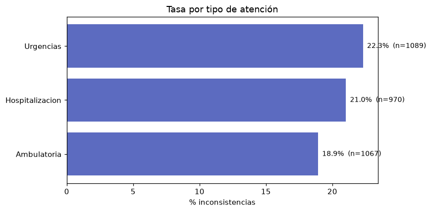 | 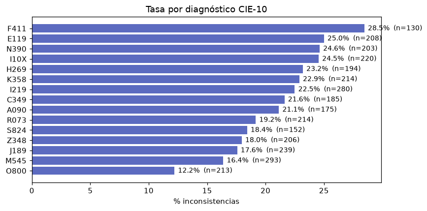 |

### Curvas ROC - Comparación de Modelos

| Escenario A (Producción) | Escenario B (Features CNN) |
|:------------------------:|:--------------------------:|
| 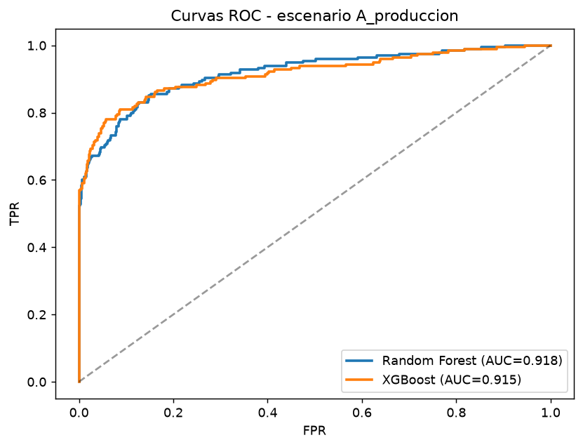 | 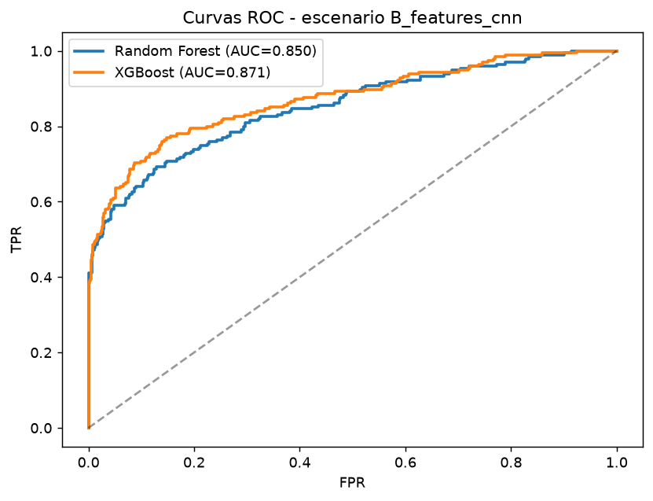 |

### Importancia de Features

| Random Forest | XGBoost |
|:-------------:|:-------:|
| 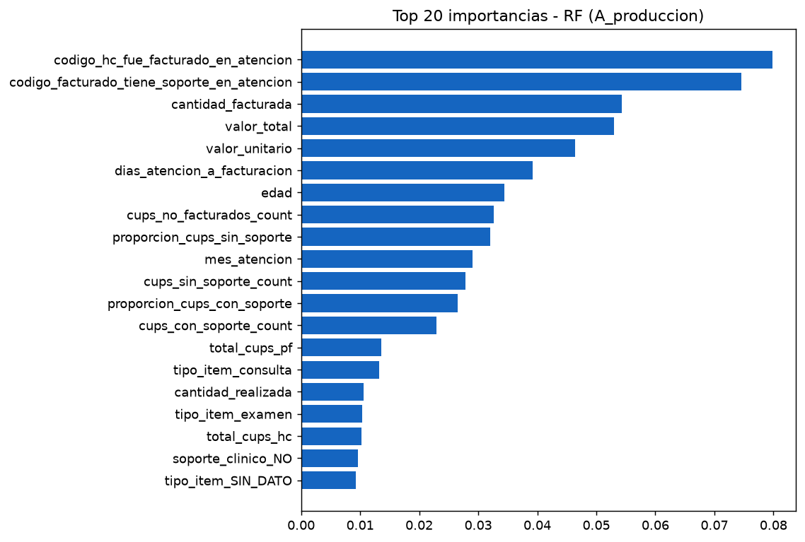 | 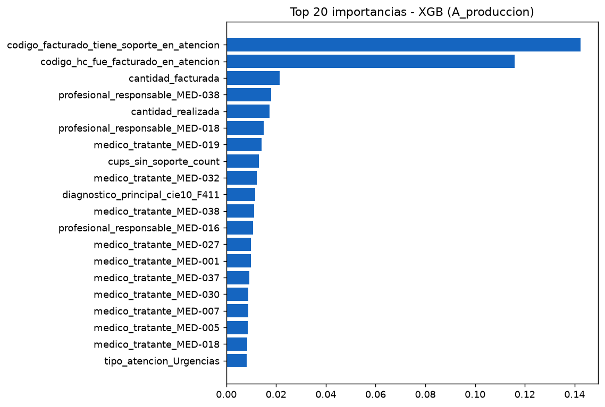 |

### Matriz de Confusión - XGBoost Avanzado

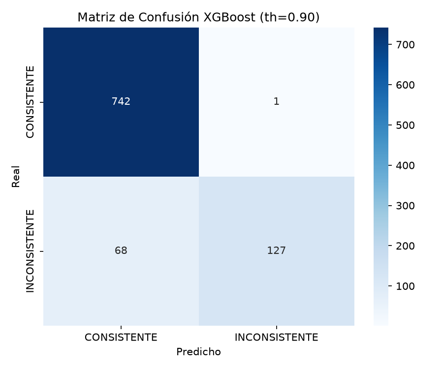

### Curvas de Entrenamiento - CNN

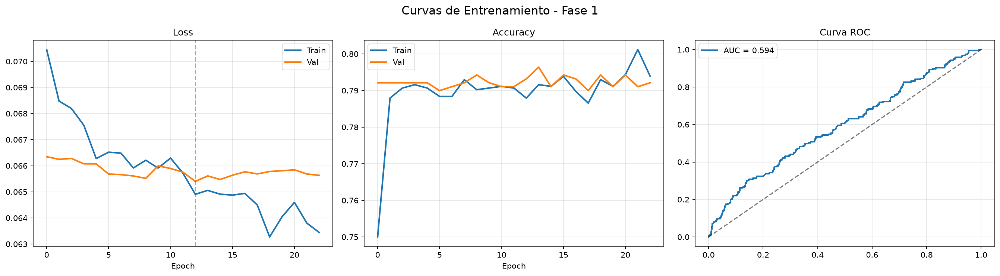

---

## 📁 Estructura del Proyecto

```
Capstone/
├── 📂 data/
│   ├── raw/                          # Datos originales
│   │   ├── 01_pacientes.csv          # 300 registros
│   │   ├── 02_atenciones.csv         # 1,200 registros
│   │   ├── 03_historia_clinica_detalle.csv  # 3,058 registros
│   │   ├── 04_prefactura.csv         # 2,974 registros
│   │   └── 05_cruce_validacion.csv   # 3,126 registros
│   └── processed/                    # Datos limpios
│       ├── pacientes_clean.csv
│       ├── atenciones_clean.csv
│       ├── hc_detalle_clean.csv
│       ├── prefactura_clean.csv
│       ├── cruce_clean.csv
│       └── dataset_maestro.csv       # Dataset consolidado
│
├── 📓 notebooks/                     # Análisis y modelado
│   ├── 01_limpieza.ipynb             # Limpieza de datos
│   ├── 02_dataset_maestro.ipynb      # Consolidación
│   ├── 03_validacion_cups.ipynb      # Validación CUPS
│   ├── 04_eda.ipynb                  # Análisis exploratorio
│   ├── 05_modelos_rf_xgb.ipynb       # Modelos RF y XGBoost
│   ├── 06_dashboard_resultados.ipynb # Visualización
│   ├── 07_entrenamiento_xgboost_avanzado.ipynb  # XGBoost optimizado
│   └── 08_modelo_cnn_transfer_learning.ipynb    # CNN
│
├── 📊 dashboard/
│   └── dashboard_auditoria.html      # Dashboard ejecutivo autocontenido (lo genera el nb 06)
│
├── 📂 outputs/
│   ├── models/                       # Modelos entrenados
│   │   ├── random_forest_A_produccion.joblib
│   │   ├── xgboost_A_produccion.joblib
│   │   ├── cnn/
│   │   └── xgboost_avanzado/
│   ├── reports/                      # Reportes y métricas
│   │   ├── metrics.json
│   │   ├── eda_hallazgos.md
│   │   └── limpieza_reporte.md
│   └── tables/                       # Tablas de referencia
│       ├── catalogo_cups_interno.csv
│       └── validacion_cups.csv
│
├── 📂 documentacion/                 # Documentación adicional
│   ├── Informe_Tecnico_LINE_APA.docx
│   ├── LINE-Auditor-Medico-Digital.pptx / .pdf
│   ├── SICortex_Panel_2.html         # Panel de tareas del equipo
│   └── AUDITORIA_REVISION_2026-07-26.md  # Hallazgos de la revisión interna
│
├── requirements.txt                  # Dependencias del pipeline
└── README.md                         # Este archivo
```

---

## 🔍 Tipos de Inconsistencias Detectadas

| Tipo de Alerta | Cantidad | Descripción |
|----------------|----------|-------------|
| **SIN SOPORTE CLINICO** | 157 | Procedimiento facturado sin respaldo en historia clínica |
| **DIAGNOSTICO NO RELACIONADO** | 152 | CIE-10 no corresponde al procedimiento |
| **NO FACTURADO** | 152 | Procedimiento con soporte clínico sin facturar (fuga) |
| **CODIGO NO COINCIDE** | 120 | Discrepancia entre CUPS HC y facturado |
| **CANTIDAD DISCORDANTE** | 68 | Diferencia en cantidades realizadas vs facturadas |

---

## 🚀 Instalación

### Requisitos

- Python 3.9+ (para el notebook 08, usar una versión soportada por TensorFlow)
- Jupyter Notebook o JupyterLab
- ~2 GB de espacio en disco

### Dependencias

```bash
pip install -r requirements.txt
```

o manualmente:

```bash
pip install pandas numpy scikit-learn xgboost matplotlib seaborn shap jupyter openpyxl joblib
pip install tensorflow   # solo necesario para el notebook 08 (CNN transfer learning)
```

### Pasos

1. **Clonar el repositorio**
   ```bash
   git clone https://github.com/jaoliverosm/Capstone-.git
   cd Capstone-
   ```

2. **Ejecutar notebooks en orden**
   ```bash
   jupyter notebook
   ```

   Seguir el orden numérico: `01` → `08`

---

## 📈 Pipeline de Procesamiento

```
┌─────────────────────────────────────────────────────────────────┐
│  1. LIMPIEZA (01_limpieza.ipynb)                               │
│     • Eliminación de duplicados                                │
│     • Corrección de formatos CUPS/CIE-10                       │
│     • Validación de claves foráneas                            │
│     • Imputación de valores faltantes                          │
├─────────────────────────────────────────────────────────────────┤
│  2. CONSOLIDACIÓN (02_dataset_maestro.ipynb)                   │
│     • Cruce de 5 tablas                                        │
│     • Ingeniería de features                                   │
│     • Codificación de variables categóricas                    │
├─────────────────────────────────────────────────────────────────┤
│  3. ANÁLISIS EXPLORATORIO (04_eda.ipynb)                       │
│     • Distribución del target                                  │
│     • Correlaciones                                            │
│     • Análisis de fugas                                        │
├─────────────────────────────────────────────────────────────────┤
│  4. MODELADO (05, 07, 08)                                      │
│     • Random Forest + XGBoost (clásicos)                       │
│     • XGBoost avanzado (hiperparámetros)                       │
│     • CNN Transfer Learning (referencia)                       │
├─────────────────────────────────────────────────────────────────┤
│  5. EVALUACIÓN                                                 │
│     • Validación cruzada 5-fold                                │
│     • Métricas: AUC-ROC, F1, Recall, Precisión                │
│     • Análisis SHAP (importancia de features)                  │
└─────────────────────────────────────────────────────────────────┘
```

---

## 🎛️ Features Principales

### Variables Numéricas (23)
- Edad del paciente
- Cantidades (realizada vs facturada)
- Valores (unitario, total)
- Días entre atención y facturación
- Proporciones de CUPS con/sin soporte
- Flags de tipo de atención (ambulatorio, hospitalario, urgencia)

### Variables Categóricas (13)
- Sexo, tipo de documento, afiliación
- Ciudad, EPS, sede
- Diagnóstico CIE-10 principal
- Médico tratante

### Features Excluidas (Leakage)
- `resultado`, `tipo_alerta`, `severidad`, `descripcion_alerta` — salidas directas del
  sistema de reglas que define el target (solo uso explicativo)
- Flags equivalentes al target a nivel de fila (p. ej. `tiene_prefactura`, usado
  solo en el EDA como descriptor, nunca como feature de modelado)

---

## 📊 Distribución del Target

```
CONSISTENTE:      2,477 (79.2%)
INCONSISTENTE:      649 (20.8%)
```

**Desbalance manejado con:** `scale_pos_weight` en XGBoost, ajuste de threshold.

---

## 🔧 Uso del Modelo

### Cargar modelo entrenado

```python
import joblib
import pandas as pd

# Cargar modelo
modelo = joblib.load('outputs/models/xgboost_A_produccion.joblib')

# Preparar datos (mismo preprocesamiento)
# ...

# Predecir
predicciones = modelo.predict_proba(X)[:, 1]

# Aplicar threshold óptimo
threshold = 0.896
alertas = predicciones >= threshold
```

### Ajustar Threshold según necesidad

| Modelo | Threshold | Recall | Precisión | Uso Recomendado |
|--------|-----------|--------|-----------|-----------------|
| XGBoost (nb 05, esc. A) | 0.50 | 72.8% | 82.6% | Balance general |
| Random Forest (nb 05, esc. A) | 0.23 | 85.1% | 60.1% | Máxima sensibilidad (foco en fugas) |
| XGBoost avanzado (nb 07) | 0.896 | 65.1% | 99.2% | Mínimos falsos positivos |

> *Cifras tomadas de `outputs/reports/metrics.json` (nb 05) y `outputs/models/xgboost_avanzado/` (nb 07).
> Ajustar el umbral según el costo relativo de falsos positivos vs falsos negativos en su contexto.*

---

## 📋 Diccionario de Datos

### Tabla: `cruce_validacion` (Grano: 1 fila = 1 registro de cruce)

| Campo | Tipo | Descripción |
|-------|------|-------------|
| id_cruce | int | Identificador único del cruce |
| id_atencion | int | FK → atenciones |
| id_prefactura | int | FK → prefactura (NULL = no facturado) |
| id_detalle_hc | int | FK → hc_detalle (NULL = sin soporte) |
| codigo_cups | string | Código CUPS del procedimiento |
| codigo_cups_facturado | string | Código CUPS en prefactura |
| resultado | string | CONSISTENTE / INCONSISTENTE |
| tipo_alerta | string | Clasificación de la inconsistencia |

---

## 🤝 Contribuciones

Las contribuciones son bienvenidas. Por favor:

1. Fork el proyecto
2. Crear una rama para la feature (`git checkout -b feature/nueva-feature`)
3. Commit los cambios (`git commit -m 'Agregar nueva feature'`)
4. Push a la rama (`git push origin feature/nueva-feature`)
5. Abrir un Pull Request

---

## 📄 Licencia

Este proyecto está bajo la Licencia MIT - ver el archivo [LICENSE](LICENSE) para detalles.

---

## 👥 Autores

>-Jefersson Aldair Oliveros (líder)
>
>-Jazmine Alexandra Acosta Bejarano
>
>-Iván Yesid Cristancho Plata
>
>-Isabella Andrea Cuesta Niebles
>
>-Catalina del Rocío Pantoja Ordóñez


---

## 🙏 Agradecimientos

- Brenda Forero (ASISTENCIAL TICS)

---


> **Nota**: Los datos utilizados son sintéticos para fines de demostración. Los modelos y metodologías son aplicables a datos reales de auditoría médica.
